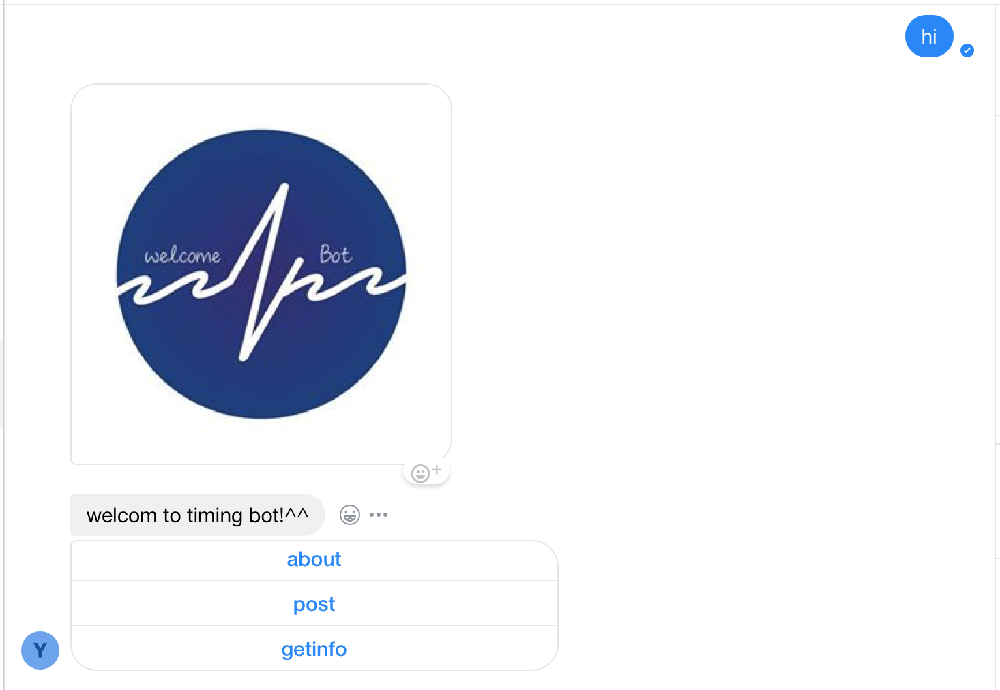
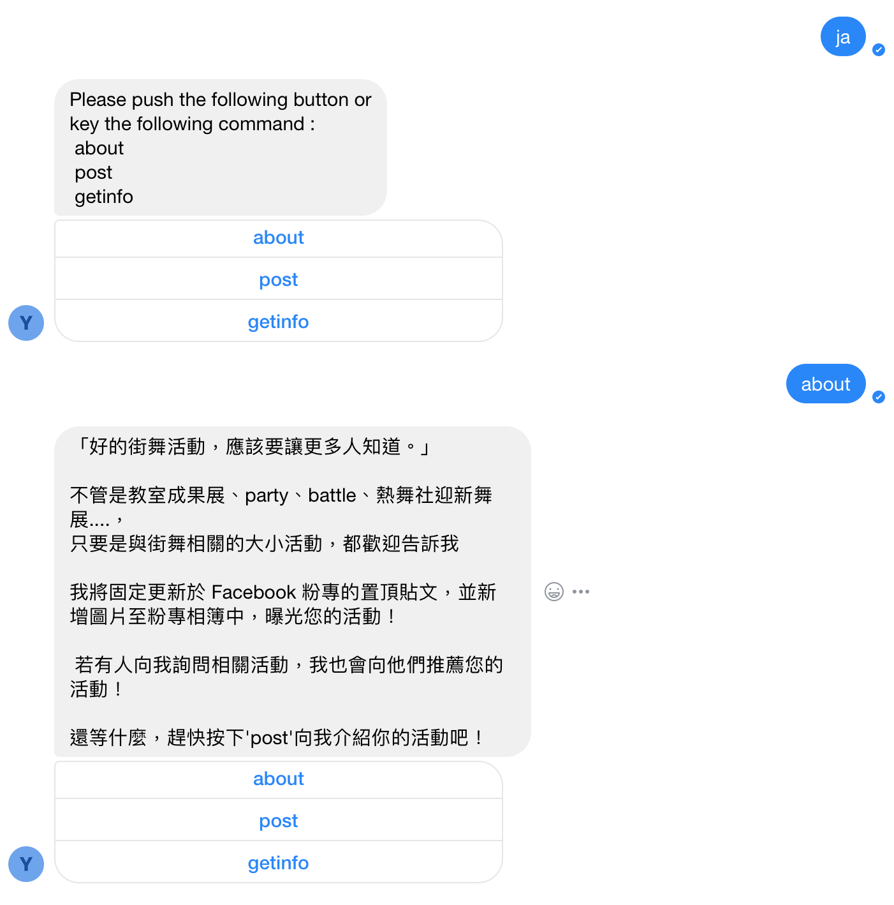
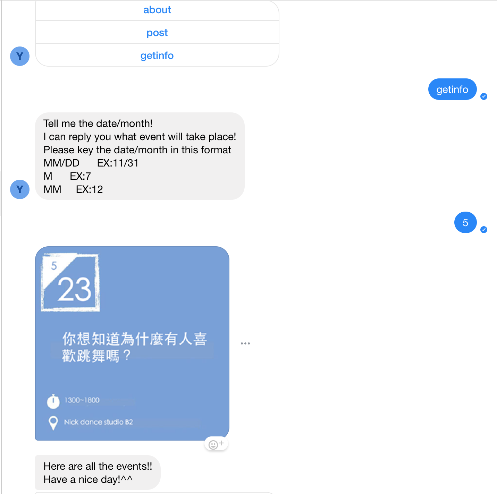

# TOC Project 2019
TIMING BOT


[Heroku version](https://github.com/ya-sin/timing-bot)(some bugs)

A Facebook messenger bot based on a finite state machine

The goal is to implement the service on the [timing facebook page](https://www.facebook.com/pg/hugtiming/photos/?tab=album&album_id=310120196363461&ref=page_internal)

A bot for doing some promotional dance activity

You can leave some information about the dance event that you really hope everyone know it or simply just want to share!

And you can get the infornation about the dance event take place in this month or on the specific day.

This bot will make a post automaticlly,so making it easier for manage a page!!

## Setup

### Prerequisite
* Python 3
* Facebook Page and App
* HTTPS Server(bottle)
* other requirments described in 'requirements.txt'

#### Install Dependency
```sh
pip install -r requirements.txt
```

* pygraphviz (For visualizing Finite State Machine)
    * [Setup pygraphviz on Ubuntu](http://www.jianshu.com/p/a3da7ecc5303)

#### Secret Data

`VERIFY_TOKEN`, and `ACCESS_TOKEN` in local.py **MUST** be set for webhook connection.

`client_id`, `client_secret`, `album_id`, `access_token`, and `refresh_token` in local.py **MUST** be set for uploading to imgur.

The json document `serviceAccount.json` also **MUST** be set for firebase.
Otherwise, you might not be able to run your code.

#### Get ACCESS_TOKEN
create a facebook page

Login with your account on facebook develop

Create a messenger app

Get `ACCESS_TOKEN` from messenger app

#### Get local.py done
Create an app on your imgur account,then you will get your `client_id` and `client_secret`

Click into the album, getting your `album_id` from the end of line in URL

Run `auth.py` for getting `access_token` and `refresh_token`

#### How to `serviceAccount.json`
Create a firebase account.

Go to firestore\database,then you can download the json from the `rule`
#### Run Locally
You can either setup https server or using `ngrok` as a proxy.

**`ngrok` would be used in the following instruction**

```sh
./ngrok http 3000
```

After that, `ngrok` would generate a https URL.

#### Run the sever

```sh
python3 app.py
```

## Finite State Machine


## Usage
The initial state is set to `fake`.

- User text anything -> get a warm welcom

`fake` state is triggered to `gotouser` to `user` state

- User text `about`/ press the `about` button -> get information about the timing bot

`user` state is triggered to `advance` to `state2` state, it will `go_back` to `user` state after the bot replies corresponding message.

- User text `post`/ press the `post` button -> get start on post procedure
`user` state is triggered to `advance` to `state3` state

`state3` state is triggered to `getname` to `class` state

`class` state is triggered to `getclass` to `date` state

`date` state is triggered to `getdate` to `time` state

`time` state is triggered to `gettime` to `location` state

`location` state is triggered to `getlocation` to `website` state

`website` state is triggered to `getwebsite` to `makepost` state, it will `go_back` to `user` state after the bot replies corresponding message.

- User text `getinfo`/ press the `getinfo` button -> get information stored in firebase based on the date you text
`user` state is triggered to `advance` to `state4` state

`state4` state is triggered to `getinput` to `getpost` state, it will `go_back` to `user` state after the bot replies corresponding message.

- User text ANYTHING exclude the above command -> give you a guid again
`user` state is triggered to `advance` to `state1` state, it will `go_back` to `user` state after the bot replies corresponding message.
---

* fake
	* Input: ANYTHING
		* Reply: image + "welcom to timing bot!^^" + postback button(about,post,getinfo)

* user
	* Input: "about"
		* Reply: "「好的街舞活動，應該要讓更多人知道。」不管是教室成果展、party、battle、熱舞社..." + postback button(about,post,getinfo)

	* Input: "post"
		* Reply: "告訴我你的活動名稱！"

	* Input: "getinfo"
		* Reply: "Tell me the date/month!I can reply you what event will take place!..."

	* Input: ANYTHING
		* Reply: "Please push the following button or key the following command :..." + postback button(about,post,getinfo)

* state3 > class > date > time > location > website
	* Input: ANYTHING
		* Reply: "活動類別(限單選) 請輸入以下選項: Party, Workshop, Dance Camp, Lecture, Showcase,Battle, Audition"
	* Input: ANYTHING
		* Reply: "活動日期/日期區間(Ex:11/31)"
	* Input: ANYTHING
		* Reply: "活動時段"
	* Input: ANYTHING
		* Reply: "活動地點"
	* Input: ANYTHING
		* Reply: "活動網址"
	* Input: ANYTHING
		* Reply: image + "This is the post will be show!! if has any problem, feel free to contact us!" +  postback button(about,post,getinfo)


* state4
	* Input: 1
		* Reply: image + "Here are all the events!!Have a nice day!^^" + postback button(about,post,getinfo)
	* Input: 9/22
		* Reply: image + "Here are all the events!!Have a nice day!^^" + postback button(about,post,getinfo)
## Demo with some examples
- welcome

- about

- post


- getinfo



